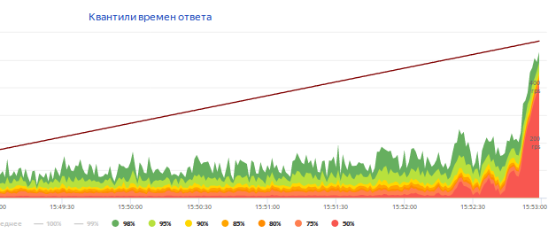

---

layout: default

---

# 

## **{{ site.presentation.title }}** {#cover}





    

	

	    {{ site.author.name }},  
	    {{ site.author.position }} 
  	    {{ site.author.company.name }}
	

## ****

## План
* Что такое BFG
* Где его взять
* И что с ним делать

## &nbsp;
{:.section}

### Что такое BFG

## Часть Яндекс.Танка

## Генераторы нагрузки

|                     | Phantom  |  JMeter  |    BFG   |
+---------------------|----------|----------|----------+
| Производительность  | Высокая  |  Средняя | Средняя  |
| Интерфейс           | Консоль  |    GUI   |   IDE    |
| Сценарии?           | Нет      |    Да    |    Да    |
| Язык сценария       |     -    |   Java   |  Python  |
+---------------------|----------|----------|----------+

## BFG: pro et contra
* Плюсы
    * это код
    * экосистема Питона
* Минусы
    * это код
    * производительность пушки не так высока

## &nbsp;
{:.section}

### Где взять

## Это опенсорс
 
Github: <b>https://github.com/yandex/yandex-tank</b>
  
Web service: <b>https://overload.yandex.net</b>
  
Support chat: <b>https://gitter.im/yandex/yandex-tank</b>

## &nbsp;
{:.section}

### И что с ним делать

## Вопросы производительности
* Время ответа
* Доля ошибок
* Стабильность
* Предельная нагрузка
* Отказ и восстановление реплики

## Нам бы побыстрее: сценарий
{:.center}

## BFG testware

* Сценарий
* Тестовые данные
* Конфигурационный файл

## Сценарий BFG: класс LoadTest

~~~ python
class LoadTest(object):
    def __init__(self, gun):
        self.gun = gun
    def get_state(self):
        response = requests.get(get_state_url)
        config = parse_state(response)
    def apply(self):
        requests.post(apply_url, data=config)

~~~

## Добавляем измерения

~~~ python
class LoadTest(object):
    def get_state(self):
        with sef.gun.measure('get_state') as measure:
            response = self.client.get_state()
            measure['proto_code'] = response.status_code
        result = parse_state(response)
~~~

## Порядок вызовов: метод default

~~~ python
 def default(self):
    self.get_state(get_state_url)
    self.apply(config)
    until state == 'DONE':
        self.check_state()
~~~

## Базовый конфиг

~~~ ini
[bfg]
gun_type = ultimate
loop = 100
instances = 10
instances_schedule = const(10,10m)
ammofile = ./ammo.txt

[ultimate_gun]
module_name = performance_test
~~~

## Время ответа по запросам
{:.center}
 

## Доля ошибок по запросам
{:.center}
 

## Теги внутри тегов: общее время транзакции

~~~ python
def get_state(self):
    with self.gun.measure("activated"):
        with self.gun.measure("apply"):
            self.apply()
        with self.gun.measure("check_state"):
            self.check_state()
~~~

## Вопросы производительности

* Время ответа +
* Доля ошибок +
* Стабильность
* Предельная нагрузка
* Отказ и восстановление реплики

## Стабильность
{:.center}

## Вопросы производительности

* Время ответа +
* Доля ошибок +
* Стабильность +
* Предельная нагрузка
* Отказ и восстановление реплики

## Профиль нагрузки: интенсивность

* instances_schedule
    * instances_schedule = line(1,3,3m)
* rps_schedule
    * instances = 10
    * rps_schedule = const(50,5m)
* free_instances
    * instances = 10

## Подкладываем соломки

~~~ ini
[autostop]
autostop = http(5xx, 20%, 60s)
autostop = time(60s, 10m)
~~~

## Стресс-тест
{:.center}
 

## Вопросы производительности

* Время ответа +
* Доля ошибок +
* Стабильность +
* Предельная нагрузка +
* Отказ и восстановление реплики

## Меняем окружение на ходу

* Гасим реплику
* Проверяем состояния
* Фиксируем объем базы

## Recovery test

## Много тестов

* Load test
* Stress test
* Stability test
* Recovery test
* Volume test

## Profit!

* Повторяемость
* Входит в регрессионный набор
* Однородность с функциональными тестами
* Легко вносить изменения

 
## **Спасибо!** {#contacts}
 

{{ site.author.name }}

{{ site.author.position }}

    

        
https://szypulka.github.io

        
szypulka@yandex-team.ru

        
telegram: szypulka

    

 
